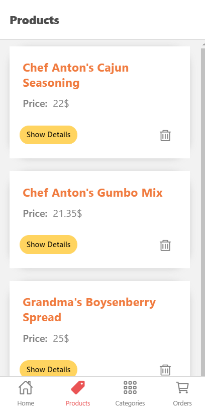

# ShoppingApp-ReactN
Here is the Cross Platform React Native project!

API Side:
Fetch data from 2 basic API
POST request

React Native Hooks:
Context Hook
State Hook

Nested Navigation:
Stack Navigation
Tab Navigation

A basic UI design with React Native Elements using flex design

Included 9 pages:
Home Page
Product Page
Category Page
Order Page
Product Detail Page
Order Detail Page
Category Product Page
Add Category Page
Update Category Page

[Source:  ](https://reactnavigation.org/) 
[Source: ](https://reactnative.dev/docs/getting-started)

Application:

